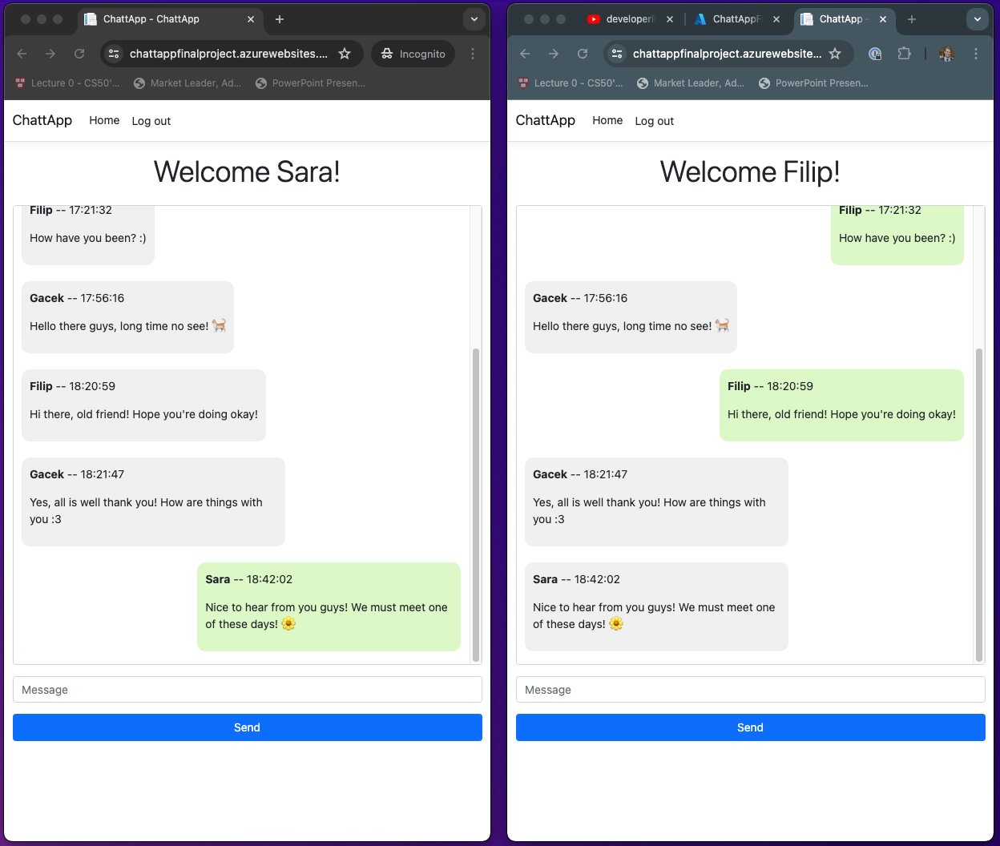
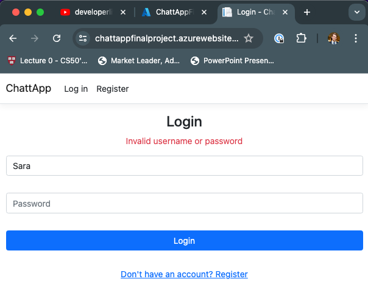
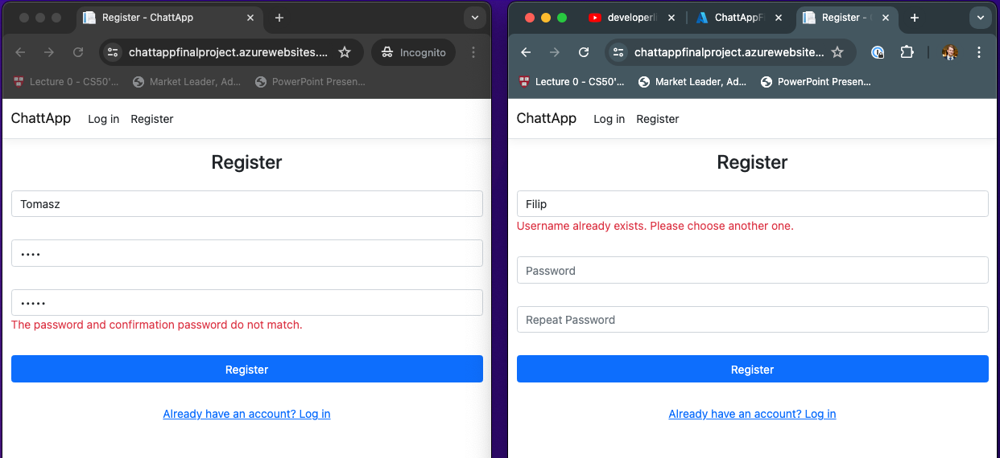
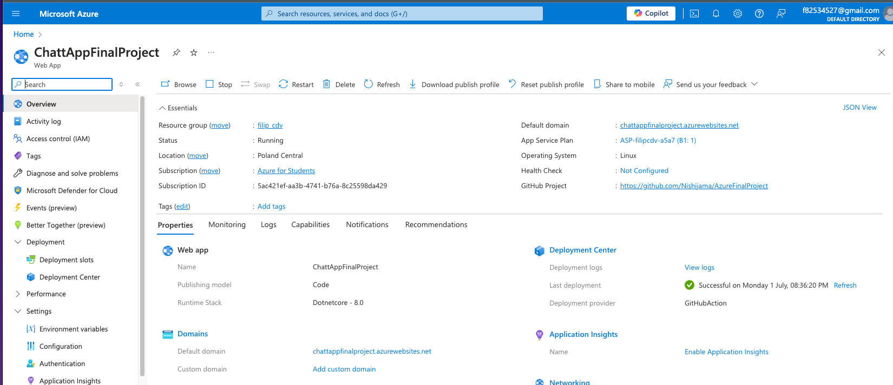
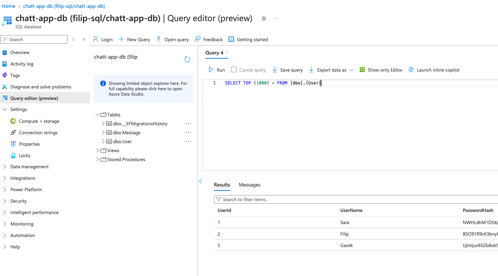

# Projekt końcowy na przedmiot Systemy i platformy zarządzania treścią
Moduł IoT and Cloud Computing
Demo aplikacji: https://youtu.be/CL45SZMyNtc

Aplikacja chatu grupowego oparta o tutoriale wykładowcy z kanału: https://www.youtube.com/@developerlifepl

Chat posiada następujące funkcjonalności:
- Hosting na Azure pod adresem: https://chattappfinalproject.azurewebsites.net/
- Baza danych z tabelami na przechowywanie wiadomości oraz dane uzytkowników
- Zarządzanie połączeniami dzięki usłudze SignalR 
- System rejestracji i logowania oparty na autentykacji i autoryzacji
- Wyswietlanie historii rozmowy (oraz ładownie poprzednich wiadomości)
- CI/CD przy uzyciu GitHub Actions
- Nowoczesny UI

### Screenshots

